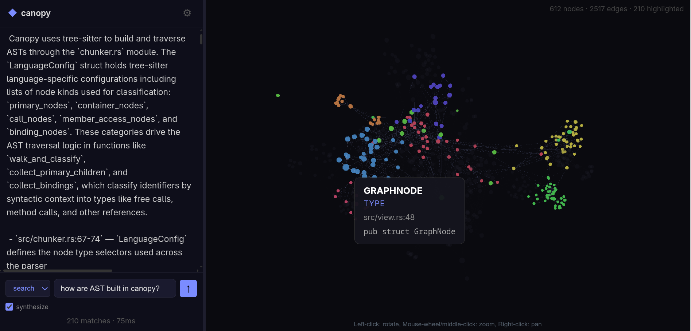

<p align="center">
  
</p>

<h1 align="center">Canopy</h1>

<p align="center">Local semantic code search for AI agents. Index once, query instantly.</p>

<p align="center">
  <a href="https://ko-fi.com/lioralabs">Support Canopy on Ko-fi</a>
</p>

Canopy uses tree-sitter to parse your code into semantic chunks, embeds them with a local model (Ollama), builds a knowledge graph of symbol relationships, and gives you fast natural-language search over the whole thing. It runs entirely on your machine — no cloud required.

## Why

AI coding agents exploring large codebases burn through tokens reading files to find what they need. Canopy gives them a semantic index — vector search plus a knowledge graph of calls, imports, and type relationships — so they can locate the right code without reading everything.

We benchmarked Canopy against baseline Claude Code (no Canopy) across 11 code exploration tasks in three large open-source projects: [rust-analyzer](https://github.com/rust-lang/rust-analyzer) (Rust, ~533K lines), [Gitea](https://github.com/go-gitea/gitea) (Go + TypeScript, ~530K lines), and [Sentry](https://github.com/getsentry/sentry) (Python + TypeScript, ~3.6M lines). 132 total runs, 3 runs per task per model per arm.

**Results (median token consumption):**

| Model | With Canopy | Baseline | Reduction |
|-------|-------------|----------|-----------|
| Claude Opus | 266K tokens | 3.9M tokens | **91%** |
| Claude Sonnet | 366K tokens | 2.9M tokens | **85%** |

Canopy reduced token usage by **85–91%** across tasks, with Opus results ranging from 82% to 96% and Sonnet from 51% to 91%. Architectural queries — tracing call chains, understanding subsystems, mapping dependencies — consistently hit 90%+ savings.

Full benchmark data: [canopy-bench](https://github.com/lioralabs/canopy-bench)

## How it works

```
source files
    |
    v
[tree-sitter] --> semantic chunks + symbol extraction
    |
    v
[embedding model] --> vector embeddings (Ollama / OpenAI-compatible)
    |
    v
[redb + usearch] --> local storage + HNSW vector index
    |
    v
[knowledge graph] --> entities + relationships (CALLS, IMPORTS, CONTAINS)
    |                  + cluster detection (label propagation)
    v
[query engine] --> vector search | graph traversals
    |
    v
[synthesis] --> optional LLM-generated natural-language answers
```

## Supported languages

Rust, TypeScript, TSX, JavaScript, Python, Go, C, C++, Java, C#

## Quick start

### Prerequisites

- Rust toolchain (`cargo`)
- [Ollama](https://ollama.com) running locally

### Install

```bash
# Pull an embedding model
ollama pull qwen3-embedding:4b

# Install canopy
cargo install --git https://github.com/lioralabs/canopy
```

### Index a project

```bash
cd /path/to/your/project

canopy init      # creates .canopy/ config directory
canopy reindex   # parses, embeds, and indexes everything
```

### Search from the CLI

```bash
# Semantic search
canopy search "how does authentication work"

# With synthesis (requires synthesis_model in config)
canopy search --synthesize "how does authentication work"

# Symbol detail
canopy map handle_login

# Trace call path between symbols
canopy trace main Database

# List subsystems
canopy clusters

# Explore a subsystem
canopy cluster auth
```

### Visualize the knowledge graph

```bash
canopy view          # opens http://localhost:8080
canopy view --port 3000
```

The web UI renders an interactive D3.js graph with collapsible cluster super-nodes, search highlighting, and node/link details on click.



## Using OpenAI or other cloud providers

Canopy works with any OpenAI-compatible API for both embeddings and synthesis. To use OpenAI instead of Ollama, edit `.canopy/canopy.toml`:

```toml
[embedding]
provider = "openai"
model = "text-embedding-3-small"
url = "https://api.openai.com"
api_key_env = "OPENAI_API_KEY"
```

Set your API key in the environment:

```bash
export OPENAI_API_KEY="sk-..."
canopy reindex
```

This also works with any OpenAI-compatible provider (Azure OpenAI, Together, Fireworks, local vLLM, etc.) — just change the `url` and `model`.

For synthesis (natural-language answers instead of raw search results), add to the `[query]` section:

```toml
[query]
synthesis_provider = "openai"
synthesis_model = "gpt-4o-mini"
# synthesis_url = "https://api.openai.com"       # defaults to embedding url
# synthesis_api_key_env = "OPENAI_API_KEY"        # defaults to embedding key
```

Then use `canopy search --synthesize "your question"` to get LLM-generated answers grounded in the indexed code.

## Exploring with Canopy

Canopy is built for AI agents exploring large codebases. The core loop is:

1. **`search`** — ask a question, find relevant symbols
2. **`map`** — orient around one symbol (signature, top callers, top callees, cluster)
3. **`trace`** — trace the call path between two symbols

### Worked example

```bash
# Starting point: "I need to add rate limiting to the login endpoint"

# 1. Find relevant symbols
canopy search "where is the login endpoint handled"

# 2. Orient on the top hit
canopy map handle_login

# 3. Trace how requests reach it
canopy trace main handle_login
```

### When to fall back to grep

Canopy is not the right tool for:

- **"Does X exist?"** — grep is instant and unambiguous
- **Reading a definition** — `Read file.rs:10-30` beats any query
- **Listing files in a directory** — glob/ls is what you want

Canopy shines for **relational questions**: "who touches X", "what's semantically near Y", "what does this subsystem contain".

## Configuration

`canopy init` creates `.canopy/canopy.toml` with sensible defaults:

```toml
[project]
name = "your-project"

[indexing]
merge_threshold = 20    # merge chunks smaller than this (lines)
split_threshold = 200   # split chunks larger than this (lines)
concurrency = 8
# ignore = ["vendor/**", "generated/**"]

[embedding]
provider = "ollama"
model = "qwen3-embedding:4b"
url = "http://localhost:11434"
# For OpenAI-compatible APIs:
# provider = "openai"
# model = "text-embedding-3-small"
# url = "https://api.openai.com"
# api_key_env = "OPENAI_API_KEY"

[query]
top_k = 15              # max results returned
graph_hops = 1          # hops for graph context expansion
min_score = 0.3         # minimum similarity threshold
symbol_boost = 0.15     # boost for symbol-matching chunks
graph_seed_top_n = 3    # top results used to seed graph expansion
max_graph_entities = 10 # cap on entities pulled from graph
symbol_top_k = 5        # top symbols returned in results
test_demotion = 0.7     # score multiplier for test files
# Optional: LLM synthesis for natural-language answers
# synthesis_provider = "ollama"
# synthesis_model = "qwen2.5-coder:32b"
```

When `synthesis_provider` and `synthesis_model` are set, `canopy search --synthesize` returns an LLM-generated answer followed by source references instead of raw chunk results.

## Commands

| Command | Description |
|---------|-------------|
| `canopy init` | Initialize canopy for a git repository |
| `canopy index` | Incremental index (only changes since last commit) |
| `canopy reindex` | Full re-index from scratch |
| `canopy search "..."` | Semantic search over the codebase |
| `canopy map SYMBOL` | Show symbol detail — signature, callers, callees, cluster |
| `canopy trace FROM TO` | Trace call path between two symbols |
| `canopy cluster ID` | Show subsystem members |
| `canopy clusters` | List all detected subsystems |
| `canopy view` | Start interactive graph visualization |
| `canopy status` | Show index stats |
| `canopy clean` | Remove all canopy data |

## What gets indexed

- **Chunks** — semantic code units (functions, structs, classes, etc.) with vector embeddings
- **Symbols** — named definitions (functions, types, traits) with dedicated embeddings for precise matching
- **Entities** — graph nodes representing code symbols with file/line metadata
- **Relationships** — edges between entities: `CALLS`, `IMPORTS`, `CONTAINS`
- **Clusters** — community groups detected via label propagation over the relationship graph

## Storage

Everything lives in `.canopy/` inside your repo (gitignored automatically):

- `canopy.toml` — configuration
- `store.redb` — chunks, symbols, entities, relationships, clusters (redb key-value store)
- `vectors.idx*` — HNSW vector indexes (usearch)

No external databases. No Docker. No network services (besides the embedding model).

## License

MIT — Liora Labs
